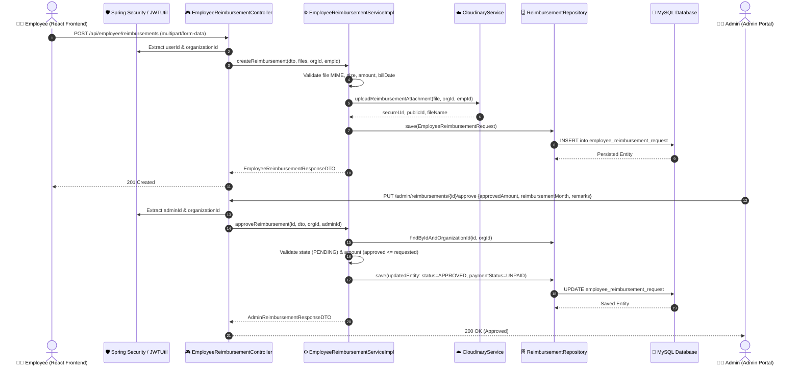

# Employee & Admin Reimbursement Module — Backend Technical Documentation

---

## 1. Executive Summary & Architecture Overview

The **Backend Reimbursement Module** is an enterprise-grade service built into the Spring Boot HRMS application (`Payroll-Bend-SBoot`). It manages the complete lifecycle of employee expense claims — from multipart submission and Cloudinary asset management to administrative auditing, amount approval, payroll billing month allocation, and audit tracking.

### Key Architectural Pillars:
- **Framework & Runtime**: Java 17, Spring Boot 3.2.5, Spring Data JPA, Hibernate, MySQL 8.
- **Security & Multi-Tenancy**: Keycloak OAuth2 / OpenID Connect Resource Server (`Bearer JWT`). Tenant isolation via `organizationId` request headers; user identification via authenticated token subject (`sub`/`userId`).
- **Cloud Storage**: Cloudinary Cloudinary API with custom folder partitioning (`{organizationId}/reimbursements/{employeeId}/`) and automated orphan cleanup rollback.
- **Payrun-Ready Lifecycle**: Separation of claim approval (`status = APPROVED`) and payroll disbursement (`payment_status = UNPAID` &rarr; `PAID` linked to `payrun_id`).

---

## 2. System Sequence Diagram



---

## 3. Database Schema & JPA Entity

### 3.1 Table Definition: `employee_reimbursement_request`

```sql
CREATE TABLE employee_reimbursement_request (
    id BIGINT AUTO_INCREMENT PRIMARY KEY,
    employee_id VARCHAR(255) NOT NULL,
    organization_id VARCHAR(255) NOT NULL,
    reimbursement_type VARCHAR(20) NOT NULL,
    requested_amount DECIMAL(12, 2) NOT NULL,
    approved_amount DECIMAL(12, 2) DEFAULT NULL,
    bill_date DATE NOT NULL,
    description VARCHAR(1000) NOT NULL,
    attachment_url VARCHAR(500) DEFAULT NULL,
    attachment_public_id VARCHAR(255) DEFAULT NULL,
    attachment_file_name VARCHAR(255) DEFAULT NULL,
    status VARCHAR(20) NOT NULL DEFAULT 'PENDING',
    remarks VARCHAR(500) DEFAULT NULL,
    payment_status VARCHAR(20) NOT NULL DEFAULT 'UNPAID',
    reimbursement_month VARCHAR(20) DEFAULT NULL,
    payrun_id VARCHAR(100) DEFAULT NULL,
    approved_by VARCHAR(200) DEFAULT NULL,
    approved_at DATETIME DEFAULT NULL,
    created_at DATETIME NOT NULL,
    updated_at DATETIME DEFAULT NULL,
    INDEX idx_reimb_emp_org (employee_id, organization_id),
    INDEX idx_reimb_org_status (organization_id, status),
    INDEX idx_reimb_payrun (payrun_id)
) ENGINE=InnoDB DEFAULT CHARSET=utf8mb4 COLLATE=utf8mb4_unicode_ci;
```

### 3.2 JPA Entity Mapping: `EmployeeReimbursementRequest.java`

- **Location**: `com.itsdev.payroll.entity.employeereimbursement.EmployeeReimbursementRequest`
- **Annotations**: `@Entity`, `@Table(name = "employee_reimbursement_request")`, `@Getter`, `@Setter`, `@NoArgsConstructor`, `@AllArgsConstructor`
- **Audit Lifecycle**:
  - `@CreationTimestamp` / `@PrePersist`: sets `createdAt` and default `status = "PENDING"`, `paymentStatus = "UNPAID"`.
  - `@UpdateTimestamp` / `@PreUpdate`: sets `updatedAt`.

---

## 4. Cloudinary Cloud Storage Integration

### 4.1 Implementation Overview
- **Interface**: `com.itsdev.payroll.service.CloudinaryService`
- **Service Implementation**: `com.itsdev.payroll.serviceimpl.CloudinaryServiceImpl`
- **Method Signature**:
  ```java
  CloudinaryUploadResponseDTO uploadReimbursementAttachment(
          MultipartFile file,
          String organizationId,
          String employeeId) throws IOException;
  ```

### 4.2 Storage Partitioning & Asset Protection
- **Folder Path**: `{organizationId}/reimbursements/{employeeId}` (e.g., `000101/reimbursements/96d84633-1857-4ce4-9438-a242137e2f64`)
- **Resource Type**: `"auto"` (supports PDF, JPEG, JPG, and PNG transparently without conversion distortion).
- **Public ID Strategy**: `reimb_{timestamp}_{randomUuid}`.
- **Rollback Safety Mechanism**: If database insertion or mapping encounters an exception after the file has already uploaded to Cloudinary, the catch block calls `cloudinaryService.deleteFile(publicId)` to ensure zero orphan file accumulation and storage billing leaks.

---

## 5. Controller Layer & API Endpoints

### 5.1 Employee Endpoints: `EmployeeReimbursementController.java`
- **Base Route**: `/api/employee/reimbursements`

| HTTP Method | Endpoint | Consumes | Description |
|---|---|---|---|
| `POST` | `/api/employee/reimbursements` | `multipart/form-data` | Primary endpoint for claims with file attachments |
| `POST` | `/api/employee/reimbursements` | `application/json` | Secondary endpoint for JSON-only submissions |
| `GET` | `/api/employee/reimbursements` | N/A | Fetch logged-in employee's reimbursement history |
| `GET` | `/api/employee/reimbursements/{id}` | N/A | Fetch single reimbursement detail by ID |

> **Note on HTTP 415 Prevention**: The multipart POST endpoint does **not** use `@RequestBody` on the DTO model. Instead, it reads individual `@RequestParam` fields or binds multipart model attributes directly, preventing Spring DispatcherServlet 415 Unsupported Media Type errors.

### 5.2 Admin Endpoints: `AdminReimbursementController.java`
- **Base Route**: `/admin/reimbursements`

| HTTP Method | Endpoint | Consumes | Description |
|---|---|---|---|
| `GET` | `/admin/reimbursements` | N/A | List all organization requests with resolved employee names/numbers |
| `GET` | `/admin/reimbursements/{id}` | N/A | Fetch full record details for Admin Review modal |
| `PUT` | `/admin/reimbursements/{id}/approve` | `application/json` | Approve claim, set approved amount, remarks, and billing month |
| `PUT` | `/admin/reimbursements/{id}/reject` | `application/json` | Reject claim with mandatory audit reason |

---

## 6. Service Layer & Business Validation Rules

### 6.1 Service Implementation: `EmployeeReimbursementServiceImpl.java`

#### 1. Submission Validation:
- **MIME Whitelist**: `application/pdf`, `image/jpeg`, `image/jpg`, `image/png`.
- **Max File Size**: 10MB per attachment.
- **Requested Amount**: Must be positive (`amount > 0.00`) and `<= 1,000,000.00`.
- **Bill Date**: Cannot be a future date (`billDate.isAfter(LocalDate.now())` throws `ValidationException`). Cannot be older than 365 days.
- **Description**: Minimum 5 characters, maximum 1000 characters.

#### 2. Approval Business Rules:
- Request must be currently in `PENDING` status. If already `APPROVED` or `REJECTED`, throws `IllegalStateException`.
- `approvedAmount` cannot be null, `<= 0`, or greater than `requestedAmount`.
- `reimbursementMonth` is recorded (e.g., `"August 2026"`).
- `status` updates to `APPROVED`.
- `paymentStatus` remains `UNPAID` (ready for payrun calculation).
- `approvedBy` is set to the admin's username/ID from the JWT.
- `approvedAt` is stamped with current UTC/IST timestamp.

#### 3. Rejection Business Rules:
- Request must be currently in `PENDING` status.
- `remarks` (rejection reason) is mandatory; if empty/null, throws `ValidationException`.
- `status` updates to `REJECTED`.
- `approvedAmount` is set to `null` or `0.00`.
- `reimbursementMonth` remains `null`.

#### 4. Bulk Profile Resolution:
- When listing admin requests via `getAdminReimbursements(organizationId)`, the service extracts all distinct `employeeId`s and executes a batch query against `BasicDetailsRepository` to populate `employeeNumber` (e.g. `EMP-001`) and `employeeName` (e.g. `John Mathew`) efficiently in $O(1)$ lookup time, preventing $N+1$ database queries.

---

## 7. Data Transfer Objects (DTOs) & Mappers

### 7.1 DTO Class Catalog

| DTO Class | Package | Purpose |
|---|---|---|
| `EmployeeReimbursementRequestDTO` | `...dto.employeereimbursement` | Request payload for employee submission |
| `ApproveReimbursementRequestDTO` | `...dto.employeereimbursement` | Request payload for admin approval (`approvedAmount`, `remarks`, `reimbursementMonth`) |
| `RejectReimbursementRequestDTO` | `...dto.employeereimbursement` | Request payload for admin rejection (`remarks`) |
| `EmployeeReimbursementResponseDTO` | `...dto.employeereimbursement` | Response representation for employee views |
| `AdminReimbursementResponseDTO` | `...dto.employeereimbursement` | Response representation for admin table and review modals |
| `CloudinaryUploadResponseDTO` | `...dto.cloudinary` | Cloudinary metadata (`secureUrl`, `publicId`, `originalFilename`, `bytes`) |

### 7.2 Billing Month Visibility Rule in Mapper
In `EmployeeReimbursementMapper.java`:
```java
// Billing Month is only exposed if the request has reached APPROVED status
if ("APPROVED".equalsIgnoreCase(entity.getStatus())) {
    dto.setReimbursementMonth(entity.getReimbursementMonth());
} else {
    dto.setReimbursementMonth(null); // Displays as '—' on frontend tables
}
```

---

## 8. Error Handling & HTTP Status Codes

The module integrates with `GlobalExceptionHandler.java` to return structured JSON responses:

```json
{
  "status": 400,
  "error": "Bad Request",
  "message": "Approved amount (6000.00) cannot exceed requested amount (5000.00).",
  "timestamp": "2026-08-17T11:03:16"
}
```

| HTTP Status | Trigger Condition |
|---|---|
| `200 OK` | Successful retrieval, approval, or rejection |
| `201 Created` | Successful reimbursement claim creation |
| `400 Bad Request` | Validation failure (invalid MIME, future date, negative amount, approved > requested) |
| `401 Unauthorized` | Missing, expired, or invalid JWT Bearer token |
| `403 Forbidden` | Accessing resource across unauthorized organization boundaries |
| `404 Not Found` | Reimbursement request ID does not exist in tenant organization |
| `409 Conflict` | Attempting to approve or reject a claim that is no longer `PENDING` |
| `500 Server Error` | Database connection error or unexpected Cloudinary SDK exception |

---

## 9. Configuration Properties

Relevant keys in `application.properties`:

```properties
# Server Port
server.port=3032

# File Upload Limits
spring.servlet.multipart.enabled=true
spring.servlet.multipart.max-file-size=10MB
spring.servlet.multipart.max-request-size=20MB

# Cloudinary Credentials
cloudinary.cloud_name=dbsu0ghks
cloudinary.api_key=371661878345717
cloudinary.api_secret=YOUR_CLOUDINARY_SECRET

# Keycloak Security
spring.security.oauth2.resourceserver.jwt.issuer-uri=http://localhost:8080/realms/payroll-realm
```

---

## 10. Future Payrun Integration Blueprint

When a payroll cycle is executed for a given billing month (e.g. `August 2026`):
1. **Query**: Select all approved reimbursements:
   ```sql
   SELECT * FROM employee_reimbursement_request 
   WHERE organization_id = :orgId 
     AND status = 'APPROVED' 
     AND payment_status = 'UNPAID' 
     AND reimbursement_month = :billingMonth;
   ```
2. **Calculation**: Add `approved_amount` to employee gross reimbursement earnings component.
3. **Disbursement**: Upon payrun finalization, update records:
   ```sql
   UPDATE employee_reimbursement_request 
   SET payment_status = 'PAID', payrun_id = :payrunId 
   WHERE id IN (:approvedIds);
   ```
