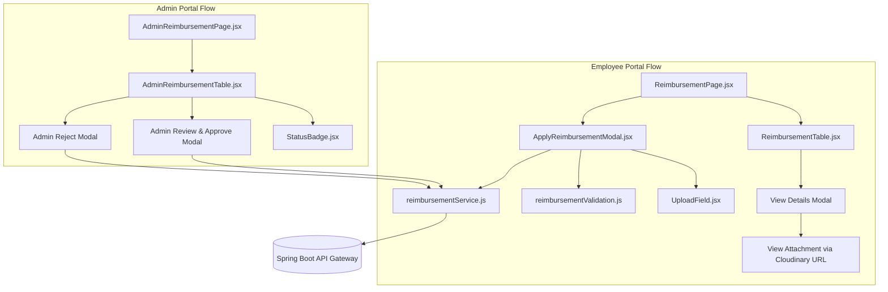

# Employee & Admin Reimbursement Module — Frontend Technical Documentation

---

## 1. Executive Summary & Overview

The **Frontend Reimbursement Module** in the React HRMS platform provides an intuitive, responsive, and secure interface for both employees and HR/Payroll administrators. 

### Core Highlights:
- **Employee Self-Service Portal**: Allows employees to claim expenses across multiple categories, attach proof of expense (bills/invoices) via drag-and-drop file uploaders, track application status, and view approved billing allocations.
- **Admin Review & Approval Portal**: Empowers administrators to audit pending claims, inspect uploaded bills directly via secure cloud links, adjust approved amounts, allocate the specific **Billing Month** for payroll processing, and approve or reject claims with audit remarks.
- **Multi-Tenant & Role-Based Isolation**: Seamlessly transmits tenant identifiers (`organizationId`) and Bearer JWT tokens via centralized Axios interceptors/headers without exposing or hardcoding sensitive IDs.

---

## 2. Directory Structure & Key Components

```
Payroll-Fend-react/src/
├── pages/
│   ├── mainPages/
│   │   ├── userPortal/
│   │   │   └── Reimbursement/
│   │   │       ├── ReimbursementPage.jsx          # Employee portal container & overview
│   │   │       ├── ReimbursementTable.jsx         # Employee request history table & view modal
│   │   │       ├── ApplyReimbursementModal.jsx    # Reimbursement claim modal form
│   │   │       ├── reimbursementValidation.js     # Form validation schema & error rules
│   │   │       └── mockReimbursements.js          # Fallback & testing mock data
│   │   └── adminReimbursement/
│   │       ├── AdminReimbursementPage.jsx         # Admin management container & filter tabs
│   │       ├── AdminReimbursementTable.jsx        # Admin table, review modal, approve/reject modals
│   │       └── mockAdminReimbursements.js         # Fallback & testing mock data
│   └── pageLayouts/
│       ├── router.js                              # Application route definitions
│       └── sidebarLayout/sidebar.js               # Navigation menu configuration
└── shared/
    ├── components/
    │   └── reimbursement/
    │       ├── StatusBadge.jsx                    # Reusable status indicator (Pending/Approved/Rejected)
    │       └── UploadField.jsx                    # Drag-and-drop multi-file uploader component
    └── services/
        └── reimbursementService.js                # Centralized Axios API service layer
```

---

## 3. Component Architecture & UI Workflows



---

## 4. Detailed Component Specifications

### 4.1 Employee Portal

#### 1. `ReimbursementPage.jsx` (`src/pages/mainPages/userPortal/Reimbursement/ReimbursementPage.jsx`)
- **Purpose**: Main entry page for employees accessing reimbursement features.
- **Features**:
  - Displays summary metric cards: *Total Claims*, *Pending Approval*, *Approved Amount*, *Rejected Claims*.
  - Search input for real-time client-side search across description, expense type, and status.
  - Quick filter buttons (`ALL`, `PENDING`, `APPROVED`, `REJECTED`).
  - "+ Apply Reimbursement" primary action button triggering `ApplyReimbursementModal`.
  - Automatic table refresh hook passed to child modals upon submission.

#### 2. `ApplyReimbursementModal.jsx` (`src/pages/mainPages/userPortal/Reimbursement/ApplyReimbursementModal.jsx`)
- **Purpose**: Modal form for submitting a new reimbursement request.
- **Form Fields & Controls**:
  - **Reimbursement Type Dropdown**: `Medical`, `Travel`, `Food`, `Internet`, `Fuel`, `Other`.
  - **Custom Type Input**: Appears conditionally when "Other" is selected. Encodes custom types cleanly into description (`[Type: CustomName] Original Description`).
  - **Bill Date Picker**: Date input restricted to past or current date (cannot be future date).
  - **Requested Amount**: Number input with INR formatting and maximum limit checks.
  - **Description**: Textarea supporting up to 1000 characters.
  - **UploadField**: Embedded dropzone accepting PDF, JPG, and PNG files up to 10MB.
- **Submission Logic**:
  - Assembles payload as `FormData`.
  - Appends `reimbursementType`, `requestedAmount`, `billDate`, `description`, and `files`.
  - Calls `createEmployeeReimbursement` service.
  - Handles response alerts with SweetAlert / custom notification helpers (`successMsg`, `errorMsg`).

#### 3. `ReimbursementTable.jsx` (`src/pages/mainPages/userPortal/Reimbursement/ReimbursementTable.jsx`)
- **Columns**:
  1. `Request Date`: Formatted date of claim creation (e.g. `11-Aug-2026`).
  2. `Expense Type`: Clean capitalized category badge.
  3. `Claimed Amount`: Currency formatted (`₹X,XXX.XX`).
  4. `Approved Amount`: Approved amount or `—` if pending/rejected.
  5. `Billing Month`: Displays allocated payroll month once approved (e.g. `August 2026`); displays `—` for pending/rejected claims.
  6. `Payment`: Status tag indicating `PAID` (Green) or `UNPAID` (Amber).
  7. `Bill Date`: Date of the expense invoice.
  8. `Status`: Color-coded pill (`PENDING` = Yellow, `APPROVED` = Green, `REJECTED` = Red).
  9. `Actions`: "View Details" action icon.
- **View Modal**: Displays complete claim snapshot, reviewer remarks, approval timestamps, and clickable attachment preview pills opening Cloudinary URLs in a secure new tab.

---

### 4.2 Admin Portal

#### 1. `AdminReimbursementPage.jsx` (`src/pages/mainPages/adminReimbursement/AdminReimbursementPage.jsx`)
- **Purpose**: Centralized administration dashboard for HR and Payroll managers.
- **Features**:
  - Filter tabs for fast status switching: `ALL`, `PENDING`, `APPROVED`, `REJECTED`.
  - Live search bar filtering by Employee Name, Employee ID (`EMP-XXX`), Description, Month, or Status.
  - Summary KPI cards with count and currency totals.

#### 2. `AdminReimbursementTable.jsx` (`src/pages/mainPages/adminReimbursement/AdminReimbursementTable.jsx`)
- **Columns**:
  1. `Employee`: Displays Employee Name & resolved `employeeNumber` (e.g., `EMP-001`).
  2. `Request Date`: Submission date.
  3. `Expense Type`: Type tag.
  4. `Claimed Amount`: Amount requested by employee.
  5. `Approved Amount`: Approved value or `—`.
  6. `Billing Month`: Assigned payroll month (only displayed when approved).
  7. `Payment`: `PAID` / `UNPAID` badge.
  8. `Status`: Status badge.
  9. `Actions`: "Review" button for pending items, "View" button for resolved items.

#### 3. Admin Review & Approve Modal:
- **Details Panel**: Displays employee information, submission date, bill date, expense category, claimed amount, description, and direct link to the Cloudinary attachment.
- **Approval Inputs**:
  - **Approved Amount Input**: Pre-filled with `requestedAmount`. Admin can modify amount; validated so `approvedAmount <= requestedAmount` and `> 0`.
  - **Billing Month Selector**: Placed between *Approved Amount* and *Remarks*.
    - Displays current year (e.g., `2026`).
    - **Selection Restriction**: Automatically disables past months. Restricts selection strictly to the **Current Month and upcoming months of the year**.
  - **Remarks Textarea**: Optional audit remarks for approval.
- **Action Buttons**:
  - `Approve`: Triggers `approveAdminReimbursement(id, { approvedAmount, remarks, reimbursementMonth })`.
  - `Reject`: Opens Rejection confirmation flow.

#### 4. Admin Reject Modal:
- Prompts for mandatory audit reason/remarks explaining why the claim was rejected.
- Triggers `rejectAdminReimbursement(id, { remarks })`.

---

### 4.3 Shared Components

#### 1. `UploadField.jsx` (`src/shared/components/reimbursement/UploadField.jsx`)
- Dropzone supporting drag-and-drop and standard file browsing.
- **Validation**:
  - Allowed types: `image/jpeg`, `image/png`, `application/pdf`.
  - Max file size: 10MB per file.
- **UI State**: Displays selected file cards with file name, file size (in KB/MB), file icon (PDF vs Image), and a remove (trash) button.

#### 2. `StatusBadge.jsx` (`src/shared/components/reimbursement/StatusBadge.jsx`)
- Standardized status chip across user and admin tables:
  - `PENDING`: Amber / Yellow badge (`ant-tag-warning`).
  - `APPROVED`: Emerald / Green badge (`ant-tag-success`).
  - `REJECTED`: Rose / Red badge (`ant-tag-error`).

---

## 5. API Service Layer (`src/shared/services/reimbursementService.js`)

Centralizes all HTTP requests via Axios with automatic JWT and multi-tenant header management:

```javascript
import axios from "axios";
import { GlobalConst } from "../appConfig/globalConst";

const getAuthHeaders = () => {
  const token = localStorage.getItem("__t");
  const organizationId = localStorage.getItem("organizationId") || "default-org-id";
  return {
    organizationId,
    Authorization: `Bearer ${token}`,
    "Content-Type": "application/json",
  };
};

// ── Employee Endpoints ──
export const getEmployeeReimbursements = async () => {
  const response = await axios.get(`${GlobalConst.API_URL}/api/employee/reimbursements`, {
    headers: getAuthHeaders(),
  });
  return response.data?.data || [];
};

export const getEmployeeReimbursementById = async (id) => {
  const response = await axios.get(`${GlobalConst.API_URL}/api/employee/reimbursements/${id}`, {
    headers: getAuthHeaders(),
  });
  return response.data?.data || response.data;
};

export const createEmployeeReimbursement = async (payload) => {
  const headers = getAuthHeaders();
  if (payload instanceof FormData) {
    delete headers["Content-Type"]; // Lets browser configure boundary automatically
  }
  const response = await axios.post(
    `${GlobalConst.API_URL}/api/employee/reimbursements`,
    payload,
    { headers }
  );
  return response.data;
};

// ── Admin Endpoints ──
export const getAdminReimbursements = async () => {
  const response = await axios.get(`${GlobalConst.API_URL}/admin/reimbursements`, {
    headers: getAuthHeaders(),
  });
  return response.data?.data || [];
};

export const getAdminReimbursementById = async (id) => {
  const response = await axios.get(`${GlobalConst.API_URL}/admin/reimbursements/${id}`, {
    headers: getAuthHeaders(),
  });
  return response.data?.data || response.data;
};

export const approveAdminReimbursement = async (id, data) => {
  const response = await axios.put(
    `${GlobalConst.API_URL}/admin/reimbursements/${id}/approve`,
    data,
    { headers: getAuthHeaders() }
  );
  return response.data;
};

export const rejectAdminReimbursement = async (id, data) => {
  const response = await axios.put(
    `${GlobalConst.API_URL}/admin/reimbursements/${id}/reject`,
    data,
    { headers: getAuthHeaders() }
  );
  return response.data;
};
```

---

## 6. Form Validation Engine (`reimbursementValidation.js`)

Located at `src/pages/mainPages/userPortal/Reimbursement/reimbursementValidation.js`, this module provides synchronous client-side validation before any payload is dispatched:

| Field | Validation Rules | Error Message |
|---|---|---|
| `reimbursementType` | Required. Must be in known list. If "Other", `customType` must be non-empty. | *"Please select a valid reimbursement type."* |
| `requestedAmount` | Required. Must be numeric, `> 0`, and `<= 1,000,000`. | *"Please enter a valid amount greater than 0."* |
| `billDate` | Required. Must be valid ISO date. Cannot be future date. Cannot be > 1 year in past. | *"Bill date cannot be in the future."* |
| `description` | Required. Min length 5 chars, max length 1000 chars. | *"Description must be between 5 and 1000 characters."* |
| `attachments` | Required. File size <= 10MB. MIME type must be PDF, JPG, or PNG. | *"File size exceeds 10MB limit."* / *"Invalid file type."* |

---

## 7. State Management & Lifecycle

1. **Mounting & Data Fetch**:
   - `useEffect` invokes `fetchReimbursements()`.
   - `loading` state displays skeleton loaders / spin animations on tables.
2. **Search & Filter Synchronization**:
   - Filtering is managed in React state, filtering items by multiple tokens without refetching from server.
   - Changing filters resets table pagination back to Page 1.
3. **Form Resetting & Cleanups**:
   - Closing modals resets errors, state flags, and selected attachment binary pointers to prevent memory leaks.
4. **Optimistic & Live Updates**:
   - On successful approval or rejection, the admin table either optimistically updates the record status or triggers a background fetch to ensure fresh server state.

---

## 8. Security & Best Practices

1. **Zero Secret Leakage**: No Keycloak client secrets or database credentials exist on the frontend.
2. **Safe Multipart Dispatch**: Headers do not hardcode `multipart/form-data; boundary=...`, allowing Axios and the browser to set accurate boundary boundaries.
3. **XSS Protection**: All user descriptions and custom types are rendered via React JSX text nodes, preventing script injection.
4. **Attachment Safety**: Attachments are opened via `target="_blank"` with `rel="noopener noreferrer"` to protect against tab-nabbing vulnerabilities.
